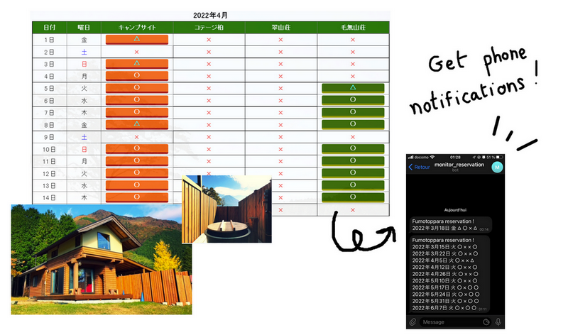

# Camping-availabilities-notification-bot

Small bot that sends a notification to a Telegram bot when there are some availabilities (for specific day like Saturday ... and specific accomodation type) in a super super popular camping place in Japan that is always full minutes after reservations are open.

If there are no availability for chosen accomodation plan and day of the week, no message is sent.



Disclaimer : This was made for study purposes. I have completely given up trying to get a reservation at this place. Please don't do anything bad with this kind of technology (scalping etc ...)
Pictures are from the official website of the camping place !

## How to run
You can run by using
```
python3 monitoring_bot.py
```

## How to set up Telegram bot
Please follow these [instructions](https://sendpulse.com/knowledge-base/chatbot/create-telegram-chatbot) !

Then, please input your url in the config file as 
```
telegram_bot_url = "https://api.telegram.org/<token>/sendMessage"
```

## Automatically run this bot periodically
You can use cron to run this script at your chosen frequency. For example
```
crontab -e
```
Then add the schedule expression. Please see this [site](https://crontab.guru/examples.html) for examples.
For example every day at 3PM would be 
```
0 15 * * * /path/to/monitoring_bot.py
```

Note. Please don't use this to do scalping !
